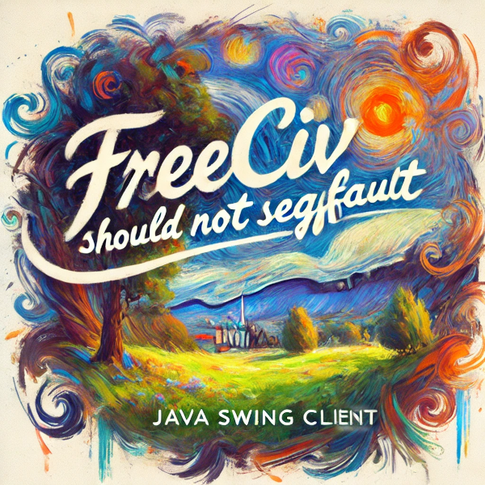

# FreecivX Java Swing Client

The **FreecivX Java Swing Client** is a graphical user interface built with Java Swing to connect to and interact with the **FreecivX Server**. 
The client provides a user-friendly way to play and manage FreecivX games, offering classic civilization-building gameplay with an enhanced experience.



## Goals
- **Cross-Platform Compatibility**: Run on any system with Java 21+.
- **User-Friendly Interface**: Provide a clean, modern, and intuitive UI for players.
- **Seamless Server Communication**: Use modern protocols like HTTP and Protocol Buffers to connect with the FreecivX server.
- **Performance Optimization**: Minimize resource usage while maintaining a smooth experience.
- **Extensibility**: Easily add new features or enhancements in the future.

## Repository Structure
This repository contains:
- **freecivx-server**: The backend server that powers the FreecivX game logic.
- **freecivx-client**: The Java Swing client that connects to the server and provides the user interface.

## Requirements
- Java 21 or later

## Quick Start
1. Build the Swing client:
   ```bash
   cd freecivx-client
   mvn clean package
   ```

2. Run the Swing client:
   ```bash
   java -jar target/freecivx-client-1.0.0.jar
   ```

## Contributing
Contributions are welcome! Feel free to submit issues or pull requests to improve the project.

## License
This project is licensed under the AGPL license.
